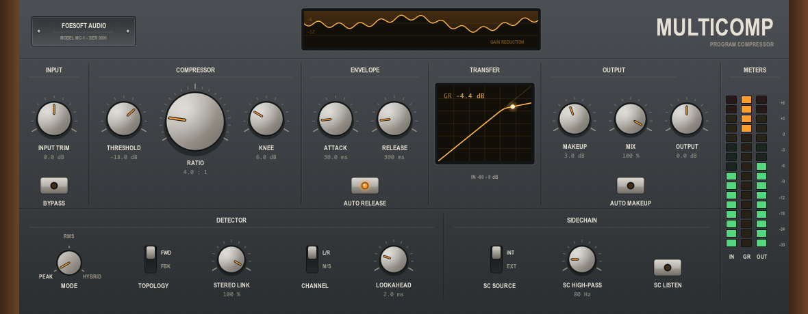

# MultiComp

A full-featured single-band compressor plugin, written in [Odin](https://odin-lang.org).
An experiment in using Odin for realtime audio and the CLAP plugin format.



Feed-forward or feedback topology, peak/RMS/hybrid detection, soft knee, lookahead with
reported latency, external sidechain with a high-pass and listen, stereo link, mid-side,
parallel mix, auto makeup and auto release. Gain-reduction history, live transfer curve,
and IN/GR/OUT metering.

## Limitations

- **macOS arm64 only.** The GUI is Cocoa + OpenGL; there is no Windows or Linux layer yet.
- **CLAP only.** No VST3 or AU wrapper.
- Fixed window size, no presets yet.
- Requires Odin `dev-2026-08-nightly` and the CLAP 1.2.10 headers.
- Check the [clap-odin](https://github.com/chronakazi/clap-odin) repo for CLAP 1.2.10 Odin bindings.

## Build

```bash
./build.sh
```

Produces `build/MultiComp.clap`. Flags combine:

| Flag | Effect |
|---|---|
| `--validate` | run [clap-validator](https://github.com/free-audio/clap-validator) against the bundle |
| `--offline` | push real audio through the built plugin and measure it |
| `--gui` | render the faceplate headlessly and check the pixels |
| `--install` | symlink into `~/Library/Audio/Plug-Ins/CLAP/` |
| `--debug` | build with debug symbols instead of `-o:speed` |

`--install` uses a symlink, so later rebuilds are picked up without reinstalling.

## Test

```bash
odin test src/dsp
```

```bash
odin test src/plugin -collection:proj=$PWD
```

```bash
./build.sh --validate --offline --gui
```

`src/dsp` needs no collection because it carries no CLAP dependency. `--offline` checks
that gain reduction matches the static curve, that bypass is transparent, and that the
impulse delay equals the reported latency. `--gui` renders the panel into a framebuffer
and reads the pixels back, and refreshes the screenshot above.

## TODO

- Windows and Linux: the DSP is portable, the window and GL context are not
- VST3 and AU builds
- Presets, resizable window, code signing

## Licence

MIT. See [LICENSE](LICENSE).
